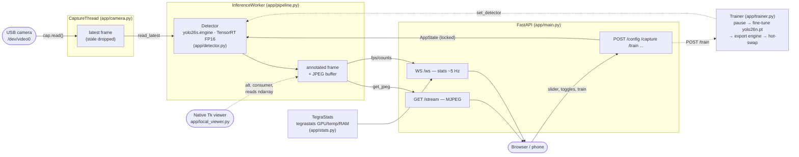
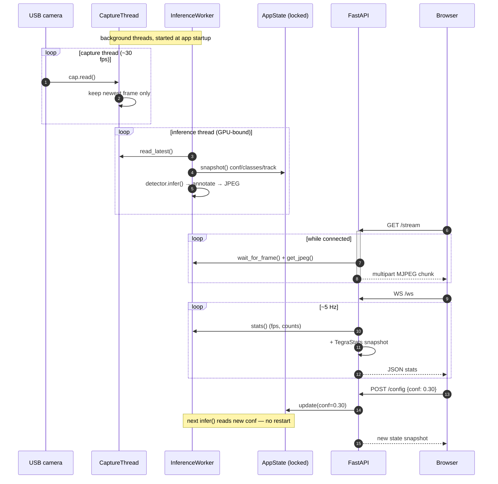

# Orin YOLO Detector

Realtime object detection (YOLO26 + TensorRT FP16) from a USB camera on a
Jetson Orin Nano Super, with a web dashboard you can open from any device on
the network.

> Default model is **yolo26s** (`BASE_MODEL` in `app/config.py`). `yolo26n` (nano)
> is faster but lower mAP — see [Detection quality](#detection-quality) to switch.

The pipeline is decoupled: camera framerate, inference rate, and number of
viewers are independent, so the live stream never lags or stalls.

## Architecture

### Block diagram

Three independent threads share state through lock-guarded buffers, so the
camera, the model, and the web clients never block each other. One USB camera
feeds either the web server *or* the native local viewer (a per-device file
lock enforces one owner at a time).



### Sequence diagram — live stream + a control change



### Sequence diagram — in-UI fine-tune

```mermaid
sequenceDiagram
    autonumber
    participant Web as Browser
    participant API as FastAPI
    participant DS as DatasetManager
    participant Tr as Trainer
    participant Wrk as InferenceWorker
    participant GPU as GPU

    Web->>API: POST /capture
    API->>DS: save raw frame → dataset/images/
    Web->>API: POST /label {boxes}
    API->>DS: write YOLO label → dataset/labels/

    Web->>API: POST /train {epochs}
    API->>Tr: start()
    Tr->>DS: build_data_yaml()
    Tr->>Wrk: pause()  %% free the single GPU
    Wrk-->>Tr: stream idle
    Tr->>GPU: fine-tune yolo26n.pt
    GPU-->>Tr: best.pt
    Tr->>GPU: export TensorRT engine → models/custom.engine
    Tr->>Wrk: set_detector(custom)  %% hot-swap
    Tr->>Wrk: resume()
    Note over Web: WS /ws streams training state → done; stream resumes on custom model
```

## 1. Install web deps
On a JetPack image, ultralytics, torch and OpenCV ship preinstalled — add only
the web layer:
```bash
pip3 install -r requirements.txt
```
**Not on a Jetson?** You also need the inference stack (CUDA build recommended):
```bash
pip3 install ultralytics opencv-python torch torchvision
```
(TensorRT export + `tegrastats` telemetry are Jetson-only; off-Jetson the app
falls back to the `.pt` model and skips GPU/temp stats.)

## 2. Check the camera
```bash
python3 scripts/check_camera.py            # /dev/video0 @ 1280x720
```
Expect ~30 FPS and non-zero frames.

## 3. Export the TensorRT engine (one time)
Build the engine for the **default model** (`yolo26s`, imgsz 1280):
```bash
python3 scripts/export_engine.py yolo26s 1280   # FP16, matches app/config.py
```
Downloads `yolo26s.pt` and builds `models/yolo26s.engine` (a few minutes). For
the faster nano model instead, run `python3 scripts/export_engine.py yolo26n 1280`
and set `BASE_MODEL = "yolo26n"` in `app/config.py`.
YOLO26 uses an NMS-free end-to-end head — simpler, lower-latency TensorRT inference.
If you skip this, the app falls back to the slower `.pt` automatically.

## 4. Run

Two modes — pick by where you watch:

**Web (remote viewing — laptop/phone on the network):**
```bash
./run.sh            # or: ./run.sh web   (PORT=9000 ./run.sh to change port)
```
Open from another device:
```
http://<orin-ip>:8000
```
Find the Orin IP with `hostname -I`.

**Local (watching on the Orin itself — lowest latency):**
```bash
./run.sh local      # native window; needs a display attached
```
A native Tk window opens straight on the Orin desktop. It skips the
JPEG-encode → HTTP MJPEG → browser-decode hop the web mode uses, so there's
no streaming/network lag — only camera + inference rate. Controls (confidence,
detect toggle, Base/Custom model, snapshot) sit on the bottom bar; press `q`
or close the window to quit. Override camera with
`./run.sh local --device 0 --width 1280 --height 720`.

Same pipeline backs both modes; the training UI lives in web mode only.

## Dashboard
- **Live video** with detection boxes
- **Stats bar** — FPS, GPU %, temperature, RAM, active model
- **Detections** — live per-class counts
- **Controls** — confidence slider, detection on/off toggle, snapshot (saves to
  `snapshots/` on the Orin and downloads to your browser)
- **Deep Scan** — on-demand SAHI sliced inference on the current frame: slices
  it into full-res tiles, detects per tile, merges. Catches small/distant
  objects the live single-pass stream misses. Heavy (a few seconds) — it runs
  on one still frame, not the live video.
- **Class filter** — search + tick COCO classes to show only those
- **Train panel** — teach the model objects it misses (see below)

## Teaching missed objects (in-UI training)

When YOLO misses something, fine-tune it from the dashboard — no CLI needed:

1. **Capture** — click *Capture frame* on a scene where detection failed. The raw
   frame is saved to `dataset/images/`.
2. **Label** — click *Label captures* → draw bounding boxes on the canvas, pick a
   class or add a new one. *Auto-assist* runs the current model at low confidence
   and pre-draws candidate boxes you just relabel. Works for **new** object types
   and for **reinforcing existing** COCO classes.
3. **Train now** — pick epochs (default 50) and click. The live stream pauses
   (single GPU), `yolo26n.pt` fine-tunes on your dataset, exports a fresh TensorRT
   engine to `models/custom.engine`, hot-swaps it in, and the stream resumes on the
   improved model.
4. **Model selector** — switch between *Base (COCO)* and your *Custom* model anytime.

Dataset lives in `dataset/` (YOLO format: `images/`, `labels/`, `classes.json`).
Training runs land in `runs/custom/`.

**Important caveat:** fine-tuning only on your captured frames specializes the
custom model to *your* classes and can weaken un-relabeled COCO classes (there is
no COCO data on-device to rehearse against). Two mitigations: the Base model stays
selectable at all times, and to keep an existing COCO class strong you should also
relabel it in your captured frames. Training defaults (epochs/imgsz/batch) are set
small in `app/config.py` to fit the Orin's 8 GB shared memory — raise carefully.

## Endpoints
| Path | What |
|------|------|
| `GET /` | dashboard |
| `GET /stream` | MJPEG annotated video |
| `WS /ws` | JSON stats ~5 Hz |
| `POST /config` | `{conf, classes, detect_enabled}` |
| `GET /snapshot` | save + download current frame |
| `POST /deepscan` | SAHI sliced inference on current frame (small objects); JPEG + `X-Counts` header |
| `GET /classes` | COCO id→name map |
| `POST /capture` | save current raw frame to dataset |
| `GET /captures` | list captured frames + label state |
| `GET /capture/{id}` | fetch a captured image |
| `POST /label/suggest` | auto-assist candidate boxes |
| `POST /label` | save YOLO label for a capture |
| `POST /class` | add a custom class |
| `GET /dataset/stats` | image / label / class counts |
| `POST /train` | start fine-tune `{epochs, imgsz, batch}` |
| `GET /train/status` | training state + progress |
| `POST /model/select` | switch `{model: base\|custom}` |

## Config
Camera device / resolution and inference defaults live in `app/config.py`
(`CAM_DEVICE`, `CAM_WIDTH`, `CAM_HEIGHT`, `DEFAULT_CONF`, `DEFAULT_IMGSZ`).

## Detection quality
Levers for "objects not detected well", by symptom:
- **Misses / wrong labels** — use a bigger model. `yolo26n` (nano) trades
  accuracy for speed; `yolo26s`/`yolo26m` have higher mAP. Export + point the
  app at it: `python3 scripts/export_engine.py yolo26s 1280`, then set
  `Detector("yolo26s")`'s basename via `BASE_MODEL` in `app/config.py`.
- **Flicker (object blinks in/out)** — **Track** toggle (on by default) runs
  ByteTrack with `persist=True`, smoothing detections across frames.
- **Dim / uneven / backlit scenes** — **CLAHE** toggle applies adaptive
  histogram equalization to luminance before inference.
- **Custom (non-COCO) objects** — the base model only knows COCO's 80 classes.
  Capture → label → train a custom model (see "Teaching missed objects").

## Small-object detection
Distant/small objects get lost when the frame is resized to the model input.
Three levers, in order of impact:
1. **Input resolution** — the engine is exported at `imgsz=1280` (set in
   `app/config.py` `DEFAULT_IMGSZ`, matched by the engine build). Higher =
   better small objects, lower FPS on the Orin. Re-export to change:
   `python3 scripts/export_engine.py yolo26n 1280` (or `960` for more FPS).
2. **Confidence** — default `0.15` (was `0.25`); small objects score low, so a
   lower threshold recovers them (at the cost of more false positives).
3. **Deep Scan** — the SAHI tiled scan above; highest recall for tiny objects,
   on-demand only (too slow for live video).

## Tuning / upgrades
- Bigger model: `python3 scripts/export_engine.py yolo26s 1280` then set
  `BASE_MODEL` in `app/config.py`.
- Lower CPU at 1080p: switch capture to a GStreamer `nvv4l2decoder` pipeline.
- Custom objects: drop in your own trained `.engine` + matching class names.

## Security

**The server has no authentication and binds `0.0.0.0` (all interfaces).** Anyone
who can reach the port can view the camera feed, save frames, add classes, and
trigger GPU training. Treat it as a **trusted-LAN tool only**:

- Do **not** expose the port to the public internet. Keep it behind your LAN /
  VPN, or put an authenticating reverse proxy (nginx/Caddy basic-auth, Tailscale)
  in front of it.
- Bind to localhost if you only watch on the Orin: run uvicorn with
  `--host 127.0.0.1` (edit `run.sh`).
- Captured frames and the fine-tuned model are written under `dataset/`,
  `snapshots/`, `runs/`, and `models/` — all are git-ignored so your private
  imagery and weights are never committed (see `.gitignore`).

Found a vulnerability? Open a private security advisory rather than a public issue.

## License

Licensed under the **GNU Affero General Public License v3.0 (AGPL-3.0)** — see
[`LICENSE`](LICENSE).

This project builds on [Ultralytics YOLO](https://github.com/ultralytics/ultralytics),
which is AGPL-3.0, so this repository is AGPL-3.0 as well. **AGPL adds a network
clause:** if you run a modified version as a network service (this app is one),
you must make your modified source available to its users. If that does not suit
your use, Ultralytics offers a commercial Enterprise license — you would need one
to relicense this work under different terms.

Third-party components: Ultralytics YOLO (AGPL-3.0), SAHI (MIT), FastAPI/Uvicorn
(MIT/BSD), OpenCV (Apache-2.0). YOLO26 model weights are downloaded from
Ultralytics under their license and are **not** redistributed in this repo.
